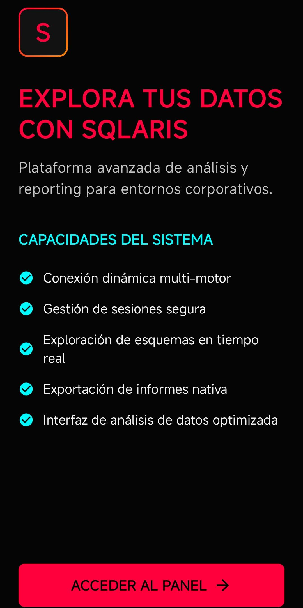
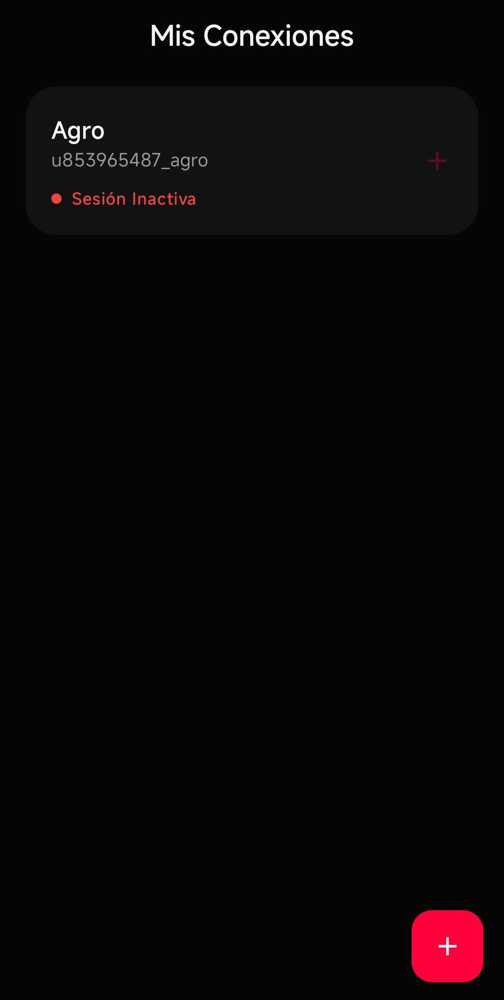
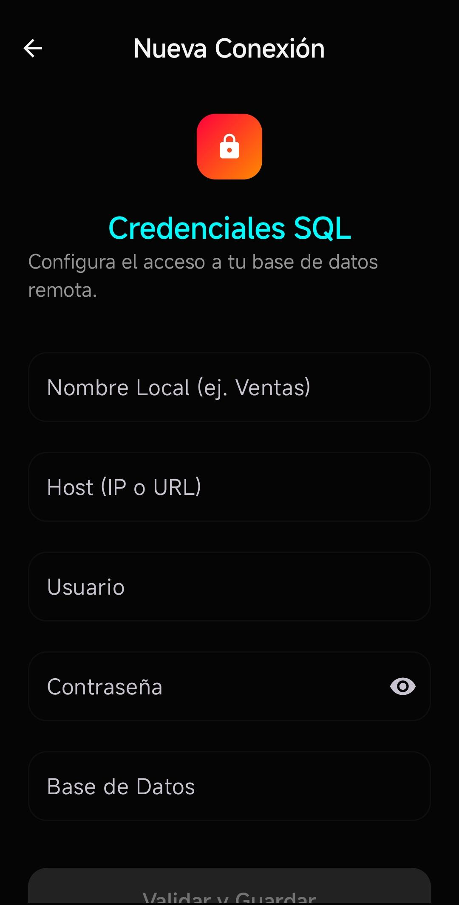
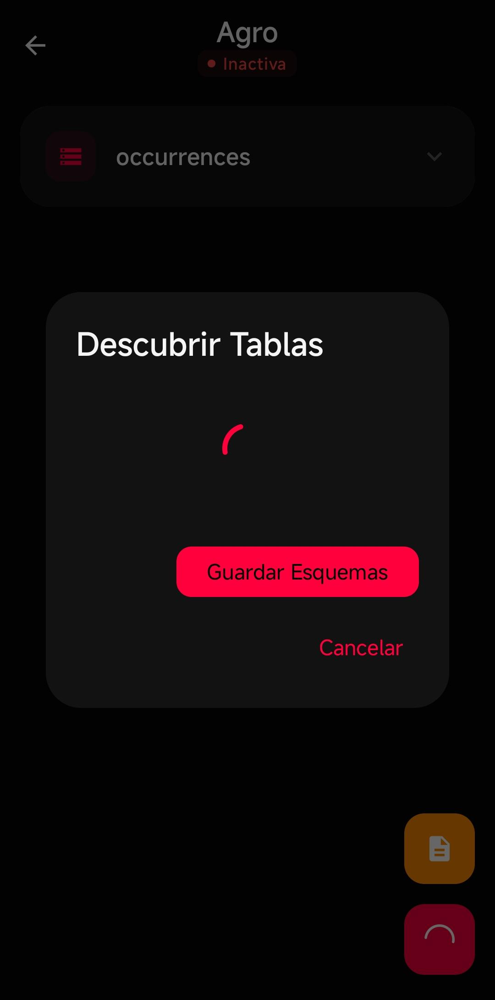
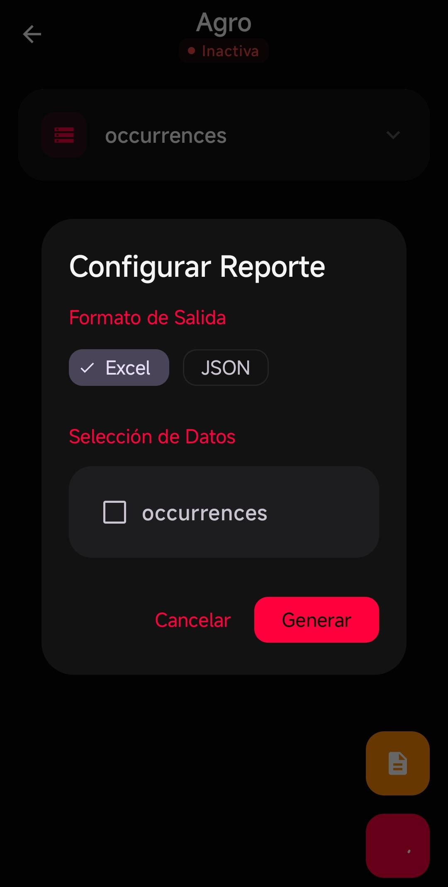

# Front-consultas
La aplicación Android es un cliente móvil de consulta y exportación de datos diseñado para conectarse dinámicamente a múltiples bases de datos SQL remotas de forma segura. La app permite al usuario registrar conexiones utilizando dirección IP o URL, credenciales y tipo de motor de base de datos, enviando la información mediante conexiones HTTPS hacia un backend desarrollado en FastAPI y Python.

Una vez validada la conexión, el sistema genera un token JWT temporal que permite reutilizar la sesión de acceso sin exponer nuevamente las credenciales sensibles. Desde la aplicación, el usuario puede explorar tablas disponibles, describir estructuras de datos, seleccionar columnas específicas y ejecutar consultas dinámicas de solo lectura sobre distintas bases de datos compatibles.

La app está orientada a funcionar como una herramienta ligera de análisis, visualización y exportación de información empresarial, integrando capacidades similares a un cliente SQL móvil y un motor de reportes dinámico.

Entre las funciones principales se incluyen:

* Conexión dinámica a múltiples motores SQL
* Gestión segura de sesiones mediante JWT
* Exploración automática de tablas y columnas
* Construcción de consultas parametrizadas
* Ejecución de múltiples consultas en una sola petición
* Control de límites y ordenamiento de resultados
* Exportación automática de información a archivos Excel
* Descarga y almacenamiento local de reportes
* Arquitectura desacoplada entre cliente móvil y motor SQL

La aplicación está diseñada para escenarios de:

* análisis de información
* monitoreo de datos
* generación de reportes móviles
* auditoría y revisión operativa
* exportación rápida de datasets empresariales

Toda la lógica de conexión y ejecución SQL se procesa desde el backend, manteniendo la aplicación Android enfocada en la experiencia de usuario, visualización de resultados y administración de consultas de manera segura y flexible.

## Capturas de Pantalla

  
  
  

  
  

